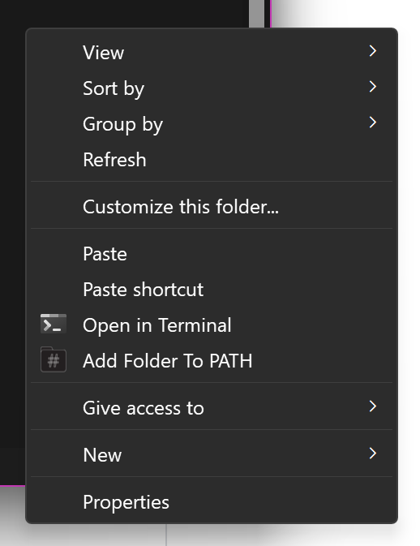
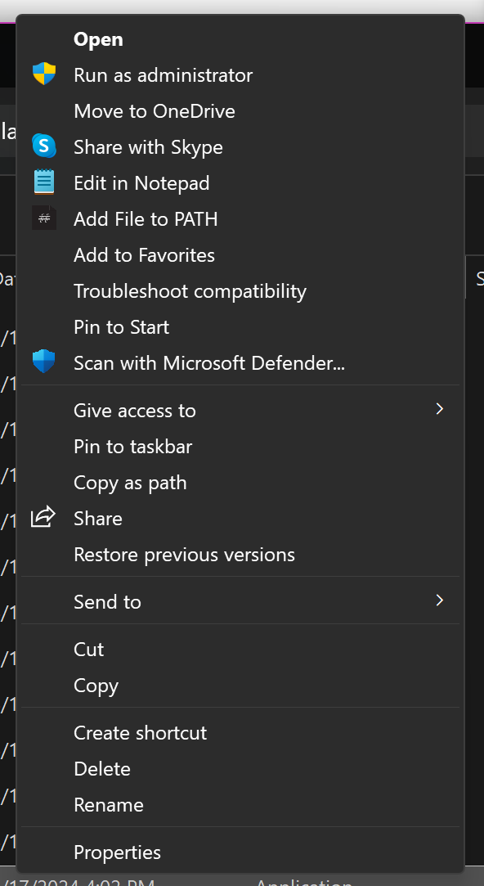
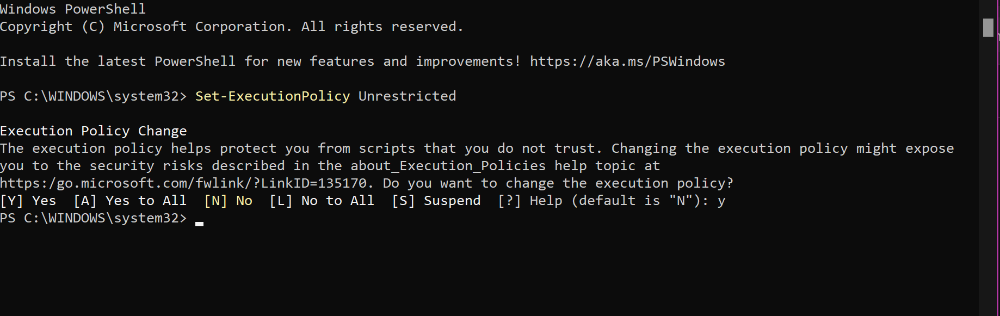

#### █▓▒▒░░░ᴛʜɪꜱ ᴘʀᴏɢʀᴀᴍ ᴀᴅᴅꜱ ᴀ "ᴀᴅᴅ ᴛᴏ ᴘᴀᴛʜ" ᴏᴘᴛɪᴏɴ ᴛᴏ ᴛʜᴇ ꜰɪʟᴇ ᴇxᴘʟᴏʀᴇʀ ᴄᴏɴᴛᴇxᴛ ᴍᴇɴᴜ (ᴛʜᴇ ᴍᴇɴᴜ ʏᴏᴜ ɢᴇᴛ ᴡʜᴇɴ ᴀ ꜰɪʟᴇ/ꜰᴏʟᴅᴇʀ ɪꜱ ʀɪɢʜᴛ ᴄʟɪᴄᴋᴇᴅ) ꜰᴏʀ ʙᴏᴛʜ ꜰɪʟᴇꜱ ᴀɴᴅ ꜰᴏʟᴅᴇʀꜱ. ᴡʜᴇɴ ᴄʟɪᴄᴋᴇᴅ, ɪᴛ ᴡɪʟʟ ʀᴜɴ ᴀ ᴘᴏᴡᴇʀꜱʜᴇʟʟ ꜱᴄʀɪᴘᴛ ᴛʜᴀᴛ ᴀᴅᴅꜱ ᴛʜᴇ ꜰɪʟᴇ/ꜰᴏʟᴅᴇʀ ᴛᴏ ᴛʜᴇ ᴡɪɴᴅᴏᴡꜱ ᴘᴀᴛʜ (ᴘʟᴀɴɴɪɴɢ ᴏɴ ᴀᴅᴅɪɴɢ ꜱᴜᴘᴘᴏʀᴛ ꜰᴏʀ ʟɪɴᴜx ᴀɴᴅ ᴘᴏꜱꜱɪʙʟʏ ᴍᴀᴄᴏꜱ ɪɴ ᴛʜᴇ ɴᴇᴀʀ ꜰᴜᴛᴜʀᴇ). ᴀʟᴛʜᴏᴜɢʜ ɴᴏᴛ ᴘᴇʀꜰᴇᴄᴛ, ᴛʜɪꜱ ᴍᴏꜱᴛʟʏ ᴡᴏʀᴋꜱ ᴀꜱ ɪ ᴀᴛᴛᴇɴᴅᴇᴅ ɪᴛ ᴛᴏ. ░░░▒▒▓█

 
# Installation:

1. First, make a clone of this repository either using `git` or by directly downloading the zip through the Github page.

`git clone https://github.com/JesusC0der/PATH-Manager/tree/master`

2. Now, extract the cloned repository somewhere and copy the folder titled `PathManager` to the root of your `C:\` drive. This step is neccessary because the registry file included with the project assumes that this folder is held here. If you'd rather place the folder somewhere else, some changes are neccesary to the registry file.

3. Semi-Finally, to apply this project, run the included registry file under the `RegistryEdits` folder. Simply put, this file just tells the registry in charge of File Explorer's context menus to add two new options, called `Add File to PATH` and `Add Folder to Path`, respectively, and points these options to their respective PowerShell scripts. It also adds icons, which are included under the `assets` folder, to these options.

4. Finally, in order to allow the PowerShell scripts to run on your PC, a command must be issued in an elevated (admin) PowerShell instance. At least from my testing, this is required as the default execution policy for PowerShell does not allow the running of scripts. To bypass this, run the command `Set-ExecutionPolicy Unrestricted`. If anyone might know of a way to run these scripts without this step, I'd be more than willing to ommit this as I feel as though this isn't the most secure thing to do as it allows any PowerShell script to run on a PC.

